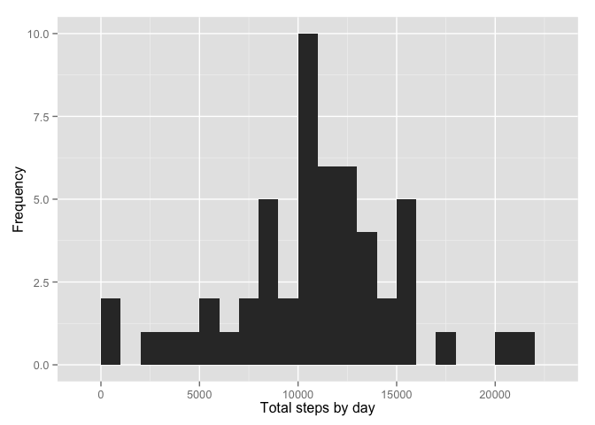
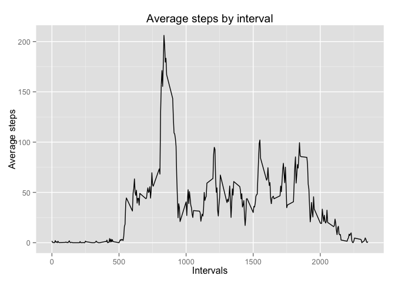
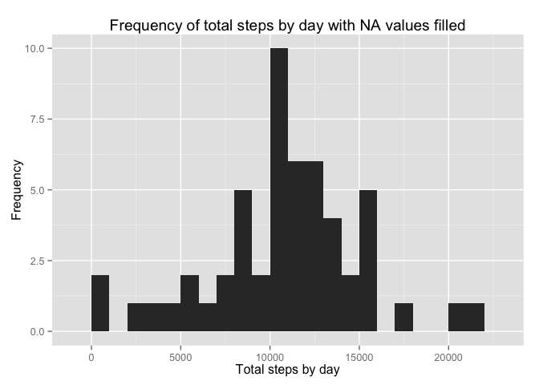
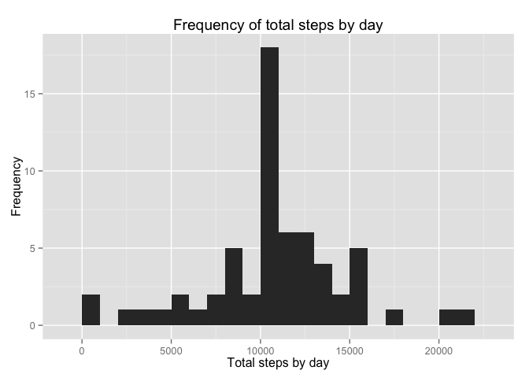
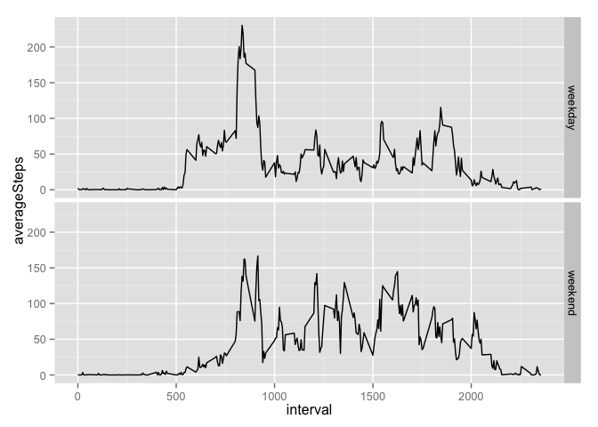

# Reproducible Research: Peer Assessment 1
      Author: Miguel Angel Vallejo Gato 


## Loading and preprocessing the data 
 

####1. Load the data (i.e. read.csv())  

We load the Libraries needed  
  

```r
library(dplyr)
library(ggplot2)
```


Before get to work, we are going to check if we have the necessary file in the correct folder.
If we don't have it, we will download and unzip the data file.


```r
#Checking file and getting it if necessary

dataset.path <- paste(getwd(),"activity.csv",sep = "/")
if(!file.exists(dataset.path))
  {
  fileURL <- "https://d396qusza40orc.cloudfront.net/repdata%2Fdata%2Factivity.zip"
  download.file(fileURL, "activity.zip", method="curl")
  unzip("activity.zip")
  remove(fileURL)
} 
```


```r
#Loading file

activity <- read.csv("activity.csv")
```

####2. Process/transform the data (if necessary) into a format suitable for your analysis

We will convert the date to a date format

```r
activity$date <- as.Date(activity$date)
```


## What is mean total number of steps taken per day?

####1. Calculate the total number of steps taken per day

We are going to ignore the missing values in the dataset

```r
TotalStepsByDay <-
    activity[!is.na(activity$steps),1:2] %>%
      group_by(date) %>%
        summarize(totalSteps = sum(steps))
```


####2. Make a histogram of the total number of steps taken each day

```r
qplot(x=TotalStepsByDay$totalSteps,xlab="Total steps by day",ylab="Frequency",binwidth=1000)
```

 


####3. Calculate and report the mean and median of the total number of steps taken per day

```r
TSMean <- mean(TotalStepsByDay$totalSteps)
TSMedian <- median(TotalStepsByDay$totalSteps)
```

Mean: 1.0766189\times 10^{4}  
Median: 10765


## What is the average daily activity pattern?

####1. Make a time series plot (i.e. type = "l") of the 5-minute interval (x-axis) and the average number of steps taken, averaged across all days (y-axis)

We will prepare the data

```r
AverageStepsByInterval <-
    activity[!is.na(activity$steps),] %>%
      group_by(interval) %>%
        summarize(averageSteps = mean(steps))
```

Drawing the plot

```r
ggplot(AverageStepsByInterval,aes(x=interval,y=averageSteps)) +
  geom_line() +
  ggtitle("Average steps by interval") +
  xlab("Intervals") +
  ylab("Average steps")
```

 


####2. Which 5-minute interval, on average across all the days in the dataset, contains the maximum number of steps?


```r
maxAvgSteps <- AverageStepsByInterval[which.max(AverageStepsByInterval$averageSteps),]$averageSteps
maxAvgStepsInterval <- AverageStepsByInterval[which.max(AverageStepsByInterval$averageSteps),]$interval
```

The maximum average number os steps is 206.1698113 and the interval is 835  

## Imputing missing values

#### 1. Calculate and report the total number of missing values in the dataset (i.e. the total number of rows with NAs)

The missing values only appears in the steps column, so we are going to count the number of NA values in this column.

```r
nrow(activity[is.na(activity$steps),])
```

```
## [1] 2304
```


#### 2. Devise a strategy for filling in all of the missing values in the dataset. The strategy does not need to be sophisticated. For example, you could use the mean/median for that day, or the mean for that 5-minute interval, etc.

We are going to fill the missing values using the mean of the steps by interval calculated previously.

#### 3. Create a new dataset that is equal to the original dataset but with the missing data filled in.


```r
activityFilled <- activity
activityFilled <- merge(activityFilled,AverageStepsByInterval, by = "interval", all.x = TRUE)
activityFilled[is.na(activityFilled$steps),]$steps <- activityFilled[is.na(activityFilled$steps),]$averageSteps
```

#### 4. Make a histogram of the total number of steps taken each day and Calculate and report the mean and median total number of steps taken per day. Do these values differ from the estimates from the first part of the assignment? What is the impact of imputing missing data on the estimates of the total daily number of steps?


```r
TotalStepsByDayFilled <-
    activityFilled[,c("date","steps")] %>%
      group_by(date) %>%
        summarize(totalSteps = sum(steps))

qplot(x=TotalStepsByDay$totalSteps,xlab="Total steps by day",ylab="Frequency",binwidth=1000,main="Frequency of total steps by day with NA values filled")
```

 

Now, we are going to show again the histogram without the NA values filled in order to compare both graphs.


```r
qplot(x=TotalStepsByDayFilled$totalSteps,xlab="Total steps by day",ylab="Frequency",binwidth=1000,main="Frequency of total steps by day")
```

 

As we can see, both graphs show the same pattern. We can only observe that new frequency is bigger due to the new values added.

Finally, we are going to calculate the new Mean and Median values.

```r
TSFillMean <- mean(TotalStepsByDayFilled$totalSteps)
TSFillMedian <- median(TotalStepsByDayFilled$totalSteps)
```


Mean: 1.0766189\times 10^{4}  
Mean without NA values: 1.0766189\times 10^{4}  
Median Filled: 10765  
Median without NA values: 1.0766189\times 10^{4}  

The Mean doesn't change because we are inserting this value. The Median has experienced a very little change. This is because the Median an the Mean value is almost the same.


## Are there differences in activity patterns between weekdays and weekends?

#### 1. Create a new factor variable in the dataset with two levels – “weekday” and “weekend” indicating whether a given date is a weekday or weekend day.

We need to change the system local time to show the days of the week using english language if we are in a not english speaking country

```r
lct <- Sys.getlocale("LC_TIME")
Sys.setlocale("LC_TIME", "C")
```

```
## [1] "C"
```

Now we are going to assign the values (weekend or weekday) and calculate the mean again


```r
activityFilled$weekDay <- factor(ifelse(weekdays(activityFilled$date) %in% c("Saturday","Sunday"),"weekend","weekday"))

AverageStepsByIntervalWeekday <-
    activityFilled %>%
      group_by(interval,weekDay) %>%
        summarize(averageSteps = mean(steps))
```


We reset the system local time again to its origin value

```r
Sys.setlocale("LC_TIME", lct)
```

```
## [1] "es_ES.UTF-8"
```

```r
remove(lct)
```


#### 2. Make a panel plot containing a time series plot (i.e. type = "l") of the 5-minute interval (x-axis) and the average number of steps taken, averaged across all weekday days or weekend days (y-axis). See the README file in the GitHub repository to see an example of what this plot should look like using simulated data.


```r
qplot(data=AverageStepsByIntervalWeekday, x=interval, y=averageSteps,
      geom='line') + facet_grid(weekDay~.)
```

 
 
As we can see there are differences in activity patterns between weekdays and weekends.
